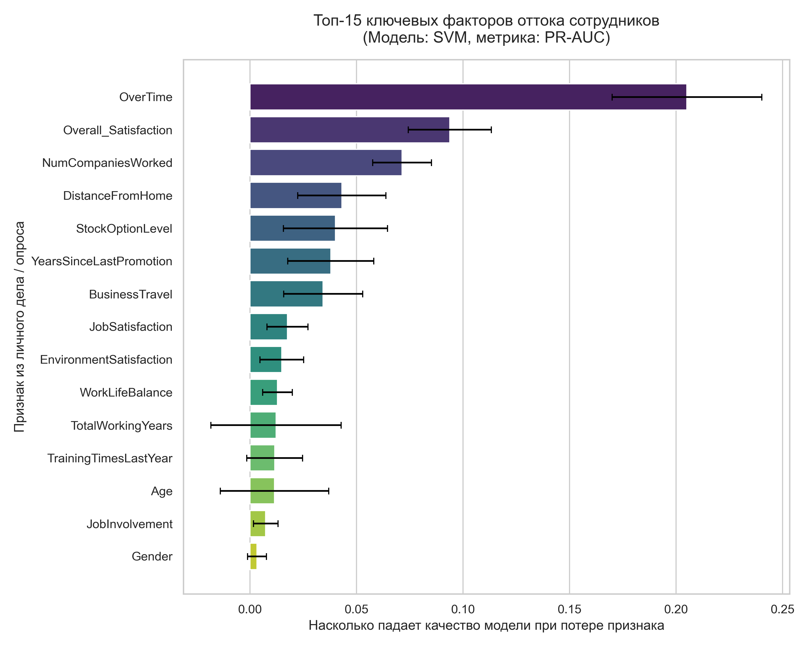
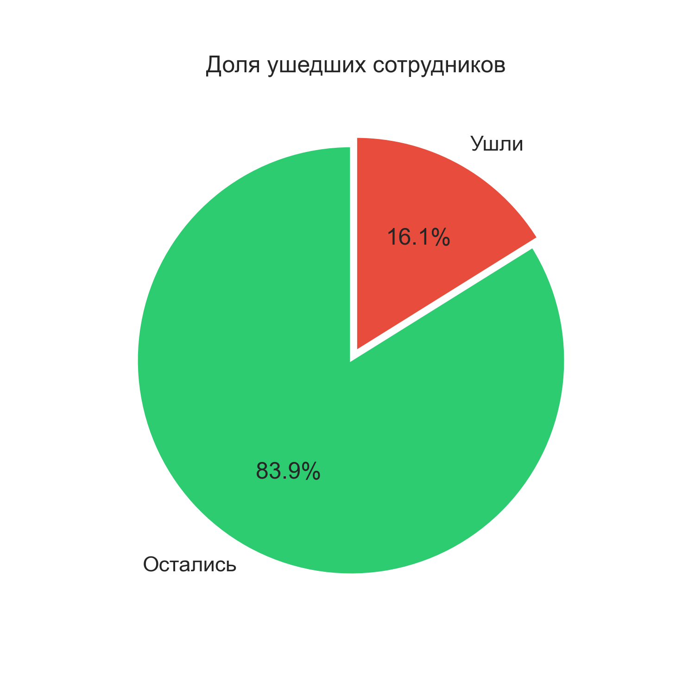
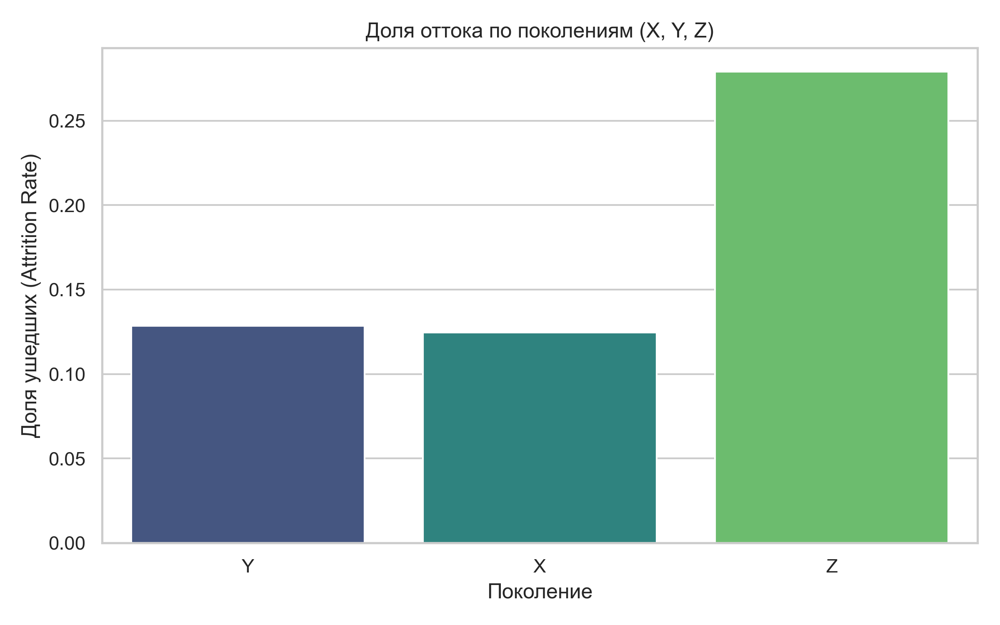
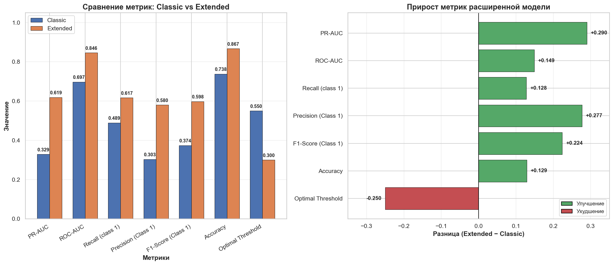

# Тема проекта: Анализ и прогнозирование оттока сотрудников
## на основе поколенческих, поведенческих и сезонно-биоритмических факторов: интеграция в классическую HR-модель

Итоговый проект курса «Аналитик данных» НИУ ВШЭ.

**Автор:** Володина Надежда  
**Научный руководитель:** Паточенко Евгений  
**Дата:** октябрь 2026

---

## О проекте

Компания теряет сотрудников. Классические HR-модели прогнозируют отток на основе демографии, структуры и компенсации, но не учитывают поведенческие и поколенческие аспекты.

Цель проекта — построить модель прогнозирования оттока, которая расширяет классический подход тремя дополнительными слоями:

1. **Поведенческий** — удовлетворённость, баланс, вовлечённость, переработки.
2. **Поколенческий** — возраст как когорта (X, Y, Z).
3. **Сезонный** — сезон рождения как прокси-переменная.

Задача — проверить, улучшают ли эти слои качество прогноза и делают ли модель более объяснимой.

---

## Датасет

- **Источник:** [Kaggle — HR Attrition Analysis and Report](https://www.kaggle.com/datasets/ilcaniaabreu/hr-attrition-analysis-and-report)
- **Размер:** 1470 записей, 35 признаков
- **Целевая переменная:** `Attrition` (Yes/No)
- **Дисбаланс классов:** 16.1% ушедших / 83.9% оставшихся

Признаки сгруппированы по смыслу:

| Группа | Примеры признаков |
|---|---|
| Демография | Age, Gender, MaritalStatus, Education, EducationField |
| Структура | Department, JobRole, JobLevel, BusinessTravel |
| Компенсация | MonthlyIncome, DailyRate, StockOptionLevel, PercentSalaryHike |
| Стаж | TotalWorkingYears, YearsAtCompany, YearsSinceLastPromotion |
| Поведение | OverTime, JobSatisfaction, EnvironmentSatisfaction, WorkLifeBalance |
| Оценки | PerformanceRating |

**Созданные признаки:**

- `Generation` — поколение (X, Y, Z, Boomer, Alpha)
- `Season_of_Birth` — сезон рождения (Winter, Spring, Summer, Autumn)
- `Overall_Satisfaction` — среднее пяти шкал удовлетворённости
- `Satisfaction_Level` — категория (Low / Medium / High)

---

## Ключевые инсайты EDA

1. **Поколение Z уходит чаще всех** — 27.9% против 12.5% (X) и 12.9% (Y).
2. **Молодые сотрудники (до 28 лет)** — основная группа риска.
3. **Одинокие уходят чаще** — 25.5% против 12.5% (женатые) и 10.1% (разведённые).
4. **Мужчины уходят чаще женщин** — 17.0% против 14.8%.
5. **Sales и HR — «горячие точки»** — 20.6% и 19.0% оттока.
6. **Human Resources и Technical Degree** — сферы образования с самым высоким оттоком (25.9% и 24.2%).
7. **Гипотеза о сезонности не подтвердилась** — сезон рождения не влияет на отток.
8. **Степень удовлетворённости** распределена равномерно между поколениями.
9. **Степень удовлетворённости** и **Переработки** являются ключевыми предикторами оттока.

Подробнее см. ноутбук в [`notebooks/`](https://github.com/nadezhdavol/hse_final_project/tree/main/notebooks).

---

## Подход

**Классическая модель (Classic)** — только демография, структура, компенсация и стаж.

**Расширенная модель (Extended)** — классические признаки + поведенческий, поколенческий и сезонный слои.

Для каждой группы обучены шесть моделей:

- Logistic Regression
- Random Forest
- XGBoost
- LightGBM
- CatBoost
- SVM

**Методология:**

- Кросс-валидация: `StratifiedKFold(n_splits=5)`
- Оптимизация: `GridSearchCV` по метрике `average_precision` (PR-AUC)
- Порог классификации подбирается на тестовой выборке (диапазон 0.20–0.60)
- Учёт дисбаланса: `class_weight='balanced'`, `scale_pos_weight`, `auto_class_weights`
- Препроцессинг: `ColumnTransformer` с раздельной обработкой числовых, порядковых, номинальных и бинарных признаков

---

## Результаты

### Сравнение лучших моделей

| Метрика | Classic | Extended | Δ |
|---|---|---|---|
| ROC-AUC | 0.697 | 0.846 | +0.149 |
| PR-AUC | 0.329 | 0.619 | +0.290 |
| F1 (attrition) | 0.374 | 0.598 | +0.224 |
| Recall (attrition) | 0.489 | 0.617 | +0.128 |
| Precision (attrition) | 0.303 | 0.580 | +0.277 |
| Accuracy | 0.738 | 0.867 | +0.129 |
| Optimal Threshold| 0.55 | 0.3 | -0.25 |

> **Вывод:** расширенная модель показала прирост по всем ключевым метрикам, что подтверждает гипотезу о ценности интеграции поведенческих и поколенческих слоёв.

### Топ-10 важных признаков (расширенная модель)

| # | Признак | Важность |
|---|---|---|
| 1 | OverTime | 0.205 |
| 2 | Overall_Satisfaction | 0.094 |
| 3 | NumCompaniesWorked | 0.071 |
| 4 | DistanceFromHome | 0.043 |
| 5 | StockOptionLevel | 0.04 |
| 6 | YearsSinceLastPromotion | 0.038 |
| 7 | BusinessTravel | 0.034 |
| 8 | JobSatisfaction | 0.018 |
| 9 | EnvironmentSatisfaction | 0.015 |
| 10 | WorkLifeBalance | 0.013 |

---

## Визуализации

### Распределение оттока

### Отток по поколениям

### Сравнение моделей

### Важность признаков

---

## Рекомендации для HR

1. **Борьба со сверхурочной работой (`OverTime`)** — ключевой драйвер оттока. Необходим аудит нагрузки в Sales и HR.
2. **Программа удержания для поколения Z** — менторство, чёткий онбординг, прозрачный карьерный трек.
3. **Повышение вовлечённости** — регулярные пульс-опросы, автономия, программы признания.
4. **Фокус на карьерное развитие** — performance review как инструмент обсуждения карьеры, инвестиции в обучение.
5. **Exit-интервью в Sales и HR** — выявление специфических проблем этих департаментов.

---

## Структура репозитория

final_project/
├── data/
│ ├── raw/ # Исходные данные
│ │ └── HR-Employee-Attrition.csv
│ └── processed/ # Подготовленные данные
│ ├── prepared_dataset.csv # После Feature Engineering
│ └── model_dataset.csv # Для подачи в модель
├── notebooks/
│ └── hse_final_project_HR_model.ipynb # Основной ноутбук
├── models/
│ ├── best_hr_churn_pipeline.pkl # Лучший пайплайн
│ ├── optimal_threshold.pkl # Оптимальный порог
├── reports/
│ ├── figures/ # Графики для презентации
│ ├── feature_importance.csv
│ ├── model_metrics.csv
│ ├── comparison.csv
├── images/ # Графики для README
├── requirements.txt
└── README.md

---

## Ограничения

1. Сезонный признак синтетический. Дата рождения сгенерирована на основе возраста, реальных дат в датасете нет. Гипотеза о сезонности не подтвердилась, но методология продемонстрирована.
2. Год рождения условный. Использован текущий год как точка отсчёта; в реальном HR-проекте данные пришли бы из HRIS.
3. Датасет небольшой (1470 записей) и, вероятно, синтетический, что ограничивает переносимость выводов на реальный бизнес.
4. Классовый дисбаланс 16/84 усложняет обучение и требует специальных методов (class weights, threshold tuning).

---

## Контакты

**Автор**: Володина Надежда

**Email**: nn_volodina@email.ru

GitHub: @nadezhda_vol
